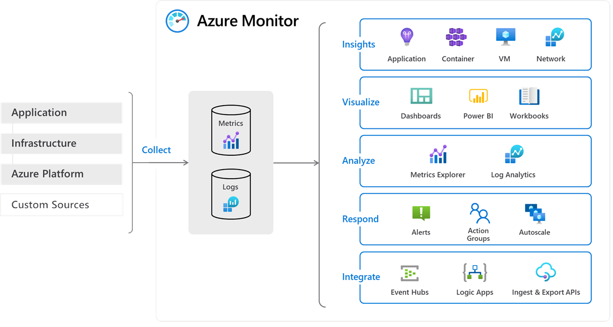
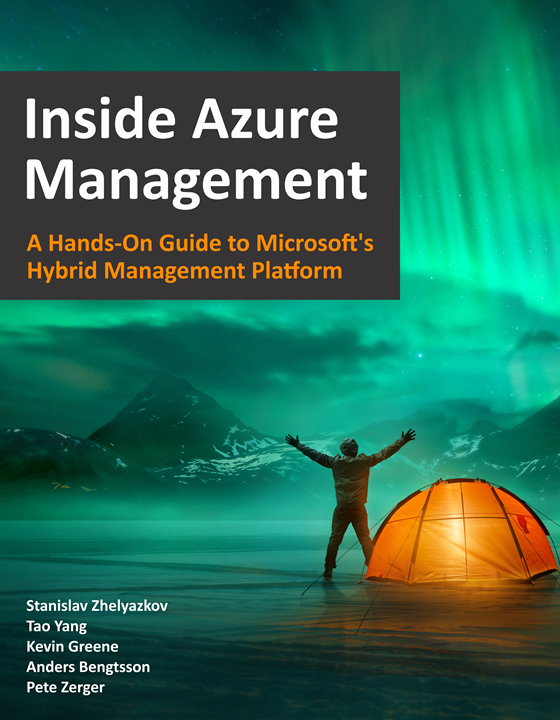

# Azure Monitor 

Ingite 2018 Microsoft announced Log Analytics, Application Insights would be brought under the Azure Monitor umbrella. See the below image from Microsoft on what Azure Monitor encompasses

# Who to Follow

There is already an existing community around Azure Monitor, providing real world examples and technical information on the products and services under Azure Monitor, including Log Analytics, Application Insights, and the Kusto Query Language that powers them and many more services.

## Microsoft Azure Monitor related twitter

@azuremonitor  
@mpauthor  
@OlegAnaniev  
@rahul_bagaria  
@SergeyKanzhelev   
@keikomsft

## Community Members and Microsoft MVPs

@cfullerMVP  
@ehrnst  
@StanZhelyazkov  
@JamesvandenBerg  
@DanielOrneling  
@MarcelMeurer  
@stefanroth_net  
@kgreeneit  
@Ciraltos  
@marcelzehner  
@msandbu  
@pzerger  
@mrtaoyang  
@scautomation  

# Azure Management Book
Several of the MVPs above have released a free ebook Insight Azure Management. The book covers Azure Monitor, Management & Governance. You can find it here https://gallery.technet.microsoft.com/Inside-the-Operations-2928e342 

